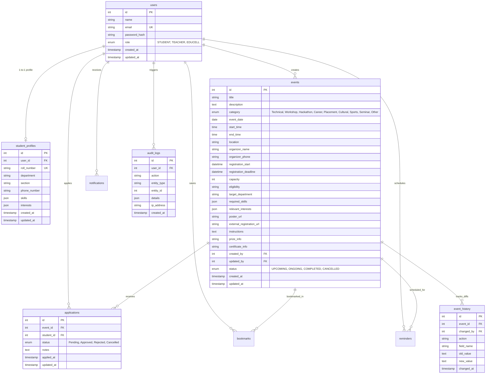

# 🌟 Eventra - AI-Powered Campus Event Discovery and Management Platform

> **"Discover. Participate. Grow."** — *Never miss an opportunity on campus.*

Eventra is a production-ready, full-stack campus event management platform. It eliminates fragmented campus communications by uniting students, faculty organizers (Teachers), and institutional coordinators (Edu Cell / SAC) on a high-performance system with strict role-based access control, locked institutional profile integrity, AI match recommendations, in-app notifications, smart reminders, and a tamper-evident audit history engine.

---

## 🏛️ Exact User Roles & Permission Matrix

There are **EXACTLY THREE USER ROLES** on Eventra:

| Capability / Feature | STUDENT | TEACHER (Faculty) | EDU CELL / SAC (Coordinator) |
| :--- | :---: | :---: | :---: |
| **Authentication & Registration** | Self-Registration + Login | Login | Login |
| **Official Profile (Name, Roll No, Dept, Sec, Phone, Email)** | **🔒 Strictly Read-Only** | Read-Only | Read-Only |
| **Custom Preferences (Skills, Interests)** | **✏️ Editable Anytime** | N/A | N/A |
| **Event Discovery, Search & Filters** | ✅ Full Access | ✅ Full Access | ✅ Full Access |
| **AI Recommendation Match % & Reasons** | ✅ Personalized | N/A | N/A |
| **1-Click Verified Event Registration** | ✅ Auto-filled | ❌ Restricted (403) | ❌ Restricted (403) |
| **Save Events (Bookmarks) & Smart Reminders** | ✅ Active | ❌ Restricted (403) | ❌ Restricted (403) |
| **Event Creation (Mandatory Validation)** | ❌ Restricted (403) | ✅ Authorized Events | ✅ All Events |
| **Event Modification & Field-Diff Audit** | ❌ Restricted (403) | ✏️ **Own Events Only** | ✏️ **All Campus Events** |
| **Event Cancellation / Deletion** | ❌ Restricted (403) | 🗑️ **Own Events Only** | 🗑️ **All Campus Events** |
| **Application Review (Approve / Reject)** | ❌ Restricted (403) | ✅ For Own Events | ✅ For All Campus Events |
| **Tamper-Evident Change History & Timeline** | View current details | 📜 Full History (Own Events) | 📜 Full Campus Audit Trail |

---

## 🛠️ Technology Stack

- **Frontend**: React 18 (TypeScript), Vite 6, Tailwind CSS, Lucide React, React Router v7, Axios, Sonner (Toast notifications), Canvas Confetti.
- **Backend**: Node.js 22, Express 4 (TypeScript / ES Modules), `mysql2/promise` connection pooling, JWT (`jsonwebtoken`), Bcryptjs password hashing, Zod schema validation, Helmet security headers, Morgan logging.
- **Database**: MySQL 8.0 with relational foreign keys, cascades, unique indexes, and audit diff tables.
- **Architecture**: Service-Repository pattern, pluggable `RecommendationEngine`, centralized RBAC middleware, and immutable official record enforcement.

---

## 🗄️ MySQL Database Schema

The database consists of 9 relational tables:



---

## 🔑 Pre-Configured Demo Accounts

All demo accounts use the standard password: `Password@123`

| Role | Name | Email | Details |
| :--- | :--- | :--- | :--- |
| **STUDENT** | Aarav Sharma | `aarav.sharma@campus.edu` | Roll: `21CS001`, Dept: CSE, AI/ML focus |
| **STUDENT** | Priya Patel | `priya.patel@campus.edu` | Roll: `21IT045`, Dept: IT, Web & Cloud |
| **STUDENT** | Rohit Verma | `rohit.verma@campus.edu` | Roll: `22EC012`, Dept: ECE, Robotics & IoT |
| **STUDENT** | Ananya Singh | `ananya.singh@campus.edu` | Roll: `22ME034`, Dept: Mechanical, EV/CAD |
| **STUDENT** | Vikram Reddy | `vikram.reddy@campus.edu` | Roll: `23MB008`, Dept: MBA, Startups/VC |
| **TEACHER** | Prof. Ravi Kumar | `prof.ravi.kumar@campus.edu` | CSE Coordinator & Hackathon Organizer |
| **TEACHER** | Prof. Sunita Sharma | `prof.sunita.sharma@campus.edu` | ECE & Robotics Club Faculty Advisor |
| **TEACHER** | Prof. Arun Deshmukh | `prof.arun.deshmukh@campus.edu` | Head Training & Placement Officer (TPO) |
| **EDU CELL** | SAC Coordinator | `sac.coordinator@campus.edu` | Student Activity Center Head Convener |
| **EDU CELL** | Edu Cell Convener | `educell.lead@campus.edu` | Educational Cell Global Lead |

---

## 📡 Complete REST API Endpoint Specification

### 1. Authentication & Profile
- `POST /api/auth/register` — Student self-registration (validates Indian phone `^[6-9]\d{9}$`, roll no uniqueness, hashes password with bcrypt).
- `POST /api/auth/login` — Universal login for Student, Teacher, and Edu Cell (returns signed JWT token).
- `GET /api/auth/me` — Returns authenticated user details and profile.
- `GET /api/profile` — Fetch user profile.
- `PUT /api/profile/preferences` — (STUDENT only) Update `skills` and `interests`. **Rejects any attempt to tamper with locked official details (Name, Roll, Dept, Section, Phone, Email)**.

### 2. Events & Change Audit
- `GET /api/events` — List campus events with filters (Search, Category, Department, Date Range, Status) and real-time personalized match percentages.
- `GET /api/events/recommendations` — (STUDENT only) Ranked recommendations based on similarity score.
- `GET /api/events/:id` — Full details with creator/updater info, live application counts, and student bookmark/application state.
- `POST /api/events` — (TEACHER & EDUCELL only) Create event with mandatory field validation. Logs `CREATED` in `event_history` & `audit_logs`.
- `PUT /api/events/:id` — (TEACHER [own] & EDUCELL [all]) Update event. Diffs previous vs new values and stores granular records in `event_history`.
- `DELETE /api/events/:id` — (TEACHER [own] & EDUCELL [all]) Mark event as `CANCELLED` and broadcasts notification to registered students.
- `GET /api/events/:id/history` — (TEACHER & EDUCELL) Fetch full chronological audit history with user names and field-level diffs.

### 3. Applications Roster
- `POST /api/events/:id/apply` — (STUDENT only) 1-click apply using verified profile. Prevents duplicates, checks deadline and capacity.
- `GET /api/applications/my` (or `/api/my/applications`) — (STUDENT only) List user's applications with status badges and organizer notes.
- `GET /api/events/:id/applications` — (TEACHER [own] & EDUCELL [all]) View student roster with verified academic details.
- `GET /api/applications/all` — (EDUCELL only) Global campus-wide application roster.
- `PATCH /api/applications/:id` — (TEACHER [own] & EDUCELL [all]) Approve or Reject application with feedback notes. Dispatches student notification.

### 4. Bookmarks, Notifications & Reminders
- `POST /api/events/:id/bookmark` — (STUDENT only) Toggle bookmark.
- `GET /api/bookmarks/my` (or `/api/my/bookmarks`) — (STUDENT only) List saved events.
- `GET /api/notifications` — Get in-app notifications.
- `PATCH /api/notifications/:id/read` — Mark notification as read (or `all`).
- `POST /api/events/:id/reminder` — (STUDENT only) Schedule `1_DAY_BEFORE` or `1_HOUR_BEFORE` reminder.
- `GET /api/reminders/my` (or `/api/my/reminders`) — (STUDENT only) List scheduled reminders.
- `DELETE /api/reminders/:id` — (STUDENT only) Cancel reminder.

### 5. Analytics Dashboard
- `GET /api/dashboard/stats` — Role-specific statistics and recent activity for Student, Teacher, and Edu Cell.

---

## 💻 Local Installation & Setup

### Prerequisites
- **Node.js**: v18.0.0 or higher (v22.x recommended)
- **MySQL Server**: v8.0 or higher
- **npm** or **pnpm** / **yarn**

### Step-by-Step Instructions

1. **Clone the repository**:
   ```bash
   git clone https://github.com/your-username/eventra.git
   cd eventra
   ```

2. **Install Server Dependencies**:
   ```bash
   cd server
   npm install
   ```

3. **Configure Environment Variables**:
   Copy `.env.example` to `.env`:
   ```bash
   cp .env.example .env
   ```
   Edit `server/.env` with your MySQL credentials:
   ```env
   PORT=5000
   NODE_ENV=development
   FRONTEND_URL=http://localhost:5173

   DB_HOST=localhost
   DB_PORT=3306
   DB_USER=root
   DB_PASSWORD=your_mysql_password
   DB_NAME=eventra_db

   JWT_SECRET=your_jwt_secret_key_here
   JWT_EXPIRES_IN=7d
   ```

4. **Initialize & Seed the Database**:
   ```bash
   npm run db:init
   npm run db:seed
   ```

5. **Start the Backend Server**:
   ```bash
   npm run dev
   ```
   Backend will start on `http://localhost:5000`. Health check at `http://localhost:5000/api/health`.

6. **Install Frontend Dependencies & Start Client**:
   In a new terminal:
   ```bash
   cd client
   npm install
   npm run dev
   ```
   Frontend will open on `http://localhost:5173`.

---

## 🧪 Testing & Automated Verification

### Automated Integration Test Suite
Run the comprehensive backend integration and security test suite:
```bash
cd server
npm test
# or: npx tsx src/tests/integration.test.ts
```

This verifies:
- Student, Teacher, and Edu Cell authentication
- 403 Forbidden enforcement when students attempt to create events
- Strict rejection when students attempt to modify locked official profile fields
- Custom skills/interests preference updates and instant AI recommendation calculations
- Event creation with mandatory field validation
- Teacher modification and granular diff recording in `event_history`
- 403 Forbidden enforcement when a teacher attempts to modify another teacher's event
- Edu Cell / SAC permission to manage teacher-created events
- 1-click application submission with duplicate application prevention (409 Conflict)
- Application approval with student in-app notifications
- Bookmarks and 24h/1h smart reminder scheduling
- Role-tailored dashboard analytics

---

## 🐳 Docker Deployment (Docker Compose)

To launch the complete platform (MySQL 8.0, Backend, Frontend) with a single command:

```bash
docker-compose up --build -d
```

- **Frontend**: `http://localhost:5173`
- **Backend API**: `http://localhost:5000`
- **MySQL Database**: `localhost:3306`

---

## 🚀 Production Deployment Guide

### 1. Frontend (Vercel / Netlify / Cloudflare Pages)
- Build Command: `npm run build`
- Output Directory: `dist`
- Environment Variables:
  - `VITE_API_URL`: `https://your-backend-domain.com/api`

### 2. Backend (Render / Railway / AWS ECS / VPS)
- Build Command: `npm run build`
- Start Command: `node dist/index.js`
- Environment Variables:
  - `PORT`: `5000`
  - `NODE_ENV`: `production`
  - `FRONTEND_URL`: `https://your-frontend-domain.com`
  - `DB_HOST`: `your-managed-db-host`
  - `DB_PORT`: `3306`
  - `DB_USER`: `your-db-user`
  - `DB_PASSWORD`: `your-db-password`
  - `DB_NAME`: `eventra_db`
  - `JWT_SECRET`: `secure_random_production_secret`

### 3. Database (PlanetScale / AWS RDS / DigitalOcean Managed MySQL)
- Create an empty database called `eventra_db`.
- Execute `server/src/database/schema.sql` to generate tables.
- Run `npm run db:seed` to populate initial campus datasets.

---

## 📂 Project Directory Structure

```
eventra/
├── .env.example
├── .gitignore
├── docker-compose.yml
├── Dockerfile.server
├── Dockerfile.client
├── package.json
├── README.md
│
├── server/                               # Node.js + Express Backend
│   ├── .env.example
│   ├── package.json
│   ├── tsconfig.json
│   └── src/
│       ├── app.ts                        # Express App Config & Middleware
│       ├── index.ts                      # Server Entry Point
│       ├── config/
│       │   └── database.ts               # MySQL Connection Pool
│       ├── database/
│       │   ├── schema.sql                # Complete MySQL DDL Schema
│       │   ├── initDb.ts                 # Database Migration Runner
│       │   └── seed.ts                   # Realistic Campus Dataset Seeder
│       ├── types/
│       │   └── index.ts                  # Backend TypeScript Types
│       ├── middleware/
│       │   ├── auth.ts                   # JWT & 3-Tier RBAC Guards
│       │   ├── validate.ts               # Zod Schemas & Validation
│       │   └── errorHandler.ts           # Centralized Error Handling
│       ├── services/
│       │   ├── auditService.ts           # Audit Logging & Event Diff Engine
│       │   ├── notificationService.ts    # In-App Notifications
│       │   └── recommendationService.ts  # AI Match Score Calculation
│       ├── controllers/
│       │   ├── authController.ts         # Register, Login, Current User
│       │   ├── profileController.ts      # Profile & Locked Fields Enforcement
│       │   ├── eventController.ts        # Event CRUD, History & Recommendations
│       │   ├── applicationController.ts  # Application Management & Approvals
│       │   ├── bookmarkController.ts     # Save / Unsave Events
│       │   ├── notificationController.ts # Notification Center
│       │   ├── reminderController.ts     # Smart 24h / 1h Reminders
│       │   └── dashboardController.ts    # Role Analytics Statistics
│       ├── routes/
│       │   ├── authRoutes.ts
│       │   ├── profileRoutes.ts
│       │   ├── eventRoutes.ts
│       │   ├── applicationRoutes.ts
│       │   ├── bookmarkRoutes.ts
│       │   ├── notificationRoutes.ts
│       │   ├── reminderRoutes.ts
│       │   └── dashboardRoutes.ts
│       └── tests/
│           └── integration.test.ts       # 20+ Automated Security & API Tests
│
└── client/                               # React + Vite + Tailwind Frontend
    ├── index.html
    ├── package.json
    ├── postcss.config.js
    ├── tailwind.config.js
    ├── tsconfig.json
    ├── vite.config.ts
    └── src/
        ├── App.tsx                       # Master Route Table
        ├── main.tsx                      # React DOM Entry
        ├── index.css                     # Tailwind CSS & Custom Styles
        ├── types/
        │   └── index.ts                  # Frontend TypeScript Types
        ├── context/
        │   ├── AuthContext.tsx           # User Session & Role Helpers
        │   └── NotificationContext.tsx   # Real-Time Notifications
        ├── services/
        │   ├── api.ts                    # Axios Client with Interceptors
        │   ├── authService.ts
        │   ├── eventService.ts
        │   ├── applicationService.ts
        │   ├── bookmarkService.ts
        │   ├── notificationService.ts
        │   ├── reminderService.ts
        │   └── dashboardService.ts
        ├── components/
        │   ├── common/
        │   │   ├── StatusBadge.tsx       # Color-Coded Status Badges
        │   │   ├── Modal.tsx             # Accessible Modal Dialog
        │   │   ├── AuditHistoryModal.tsx # Event Diff Timeline Modal
        │   │   ├── ReminderModal.tsx     # Smart Reminder Dialog
        │   │   ├── ApplicationModal.tsx  # 1-Click Auto-filled Apply Modal
        │   │   ├── EventCard.tsx         # Rich Event Card with Match Badge
        │   │   └── ProtectedRoute.tsx    # Role Route Guard
        │   └── layout/
        │       ├── Navbar.tsx            # Top Bar with Demo Switcher
        │       ├── Sidebar.tsx           # Role Tailored Navigation Links
        │       └── DashboardLayout.tsx   # Master App Layout Shell
        └── pages/
            ├── public/
            │   ├── LandingPage.tsx       # Discovery Hero & Feature Grid
            │   ├── LoginPage.tsx         # 1-Click Demo Login
            │   └── RegisterPage.tsx      # Student Verified Registration
            ├── student/
            │   ├── StudentDashboard.tsx  # AI Recommendations & Quick Stats
            │   ├── EventDiscoveryPage.tsx# Search, Filter Pills & Sort
            │   ├── EventDetailsPage.tsx  # Full Event Page (Locked Controls)
            │   ├── SavedEventsPage.tsx   # Bookmarks Grid
            │   ├── MyApplicationsPage.tsx# Live Application Status Tracker
            │   ├── StudentNotificationsPage.tsx
            │   ├── StudentRemindersPage.tsx
            │   └── StudentProfilePage.tsx# Locked Records + AI Preferences
            ├── teacher/
            │   ├── TeacherDashboard.tsx  # Faculty Stats & Quick Actions
            │   ├── TeacherEventsPage.tsx # Created Events Table
            │   ├── CreateEventPage.tsx   # Mandatory Validation Form
            │   ├── EditEventPage.tsx     # Authorized Edit with Diff Logging
            │   ├── EventApplicationsPage.tsx # Review Roster & Approvals
            │   └── TeacherProfilePage.tsx
            └── educell/
                ├── EduCellDashboard.tsx  # Campus Wide Analytics
                ├── EduCellAllEventsPage.tsx # Global Event Management
                ├── EduCellApplicationsPage.tsx # Campus Applications Registry
                ├── EduCellAuditPage.tsx  # System Audit Logs
                └── EduCellProfilePage.tsx
```

---

## 🔒 Security & Quality Standards

- **No Plaintext Passwords**: Passwords hashed using bcrypt (10 salt rounds).
- **JWT Authentication**: Statistically signed JSON Web Tokens with strict expiry.
- **Strict Server-Side Authorization**: API routes reject unauthorized student event modifications (403 Forbidden) and cross-organizer modifications.
- **Locked Institutional Data**: Student names, roll numbers, departments, sections, phones, and emails cannot be modified post-registration.
- **Audit Diff Engine**: Every modification to events computes old vs new values and creates immutable entries in `event_history`.
- **Zero Hard-Coded Credentials**: Driven entirely by `.env` configuration.

---

## 📜 License

MIT License. Designed and engineered for university excellence.
