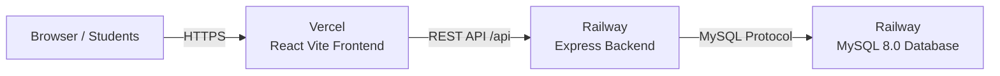

# 🌟 Eventra - AI-Powered Campus Event Discovery and Management Platform

> **"Discover. Participate. Grow."** — *Never miss an opportunity on campus.*

Eventra is a production-ready, full-stack campus event management platform. It eliminates fragmented campus communications by uniting students, faculty organizers (Teachers), and institutional coordinators (Edu Cell / SAC) on a high-performance system with strict role-based access control, locked institutional profile integrity, AI match recommendations, in-app notifications, smart reminders, and a tamper-evident audit history engine.

---

## 🏛️ Exact User Roles & Permission Matrix

There are **EXACTLY THREE USER ROLES** on Eventra:

| Capability / Feature | STUDENT | TEACHER (Faculty) | EDU CELL / SAC (Coordinator) |
| :--- | :---: | :---: | :---: |
| **Authentication & Registration** | Self-Registration + Login | Login | Login |
| **Official Profile (Name, Roll No, Dept, Sec, Phone, Email)** | **🔒 Strictly Read-Only** | Read-Only | Read-Only |
| **Custom Preferences (Skills, Interests)** | **✏️ Editable Anytime** | N/A | N/A |
| **Event Discovery, Search & Filters** | ✅ Full Access | ✅ Full Access | ✅ Full Access |
| **AI Recommendation Match % & Reasons** | ✅ Personalized | N/A | N/A |
| **Direct 1-Click Event Registration** | ✅ **Instant Confirmed** (No approval needed) | ❌ Restricted (403) | ❌ Restricted (403) |
| **Save Events (Bookmarks) & Smart Reminders** | ✅ Active | ❌ Restricted (403) | ❌ Restricted (403) |
| **Event Creation & Publishing** | ❌ Restricted (403) | ✅ **Direct & Instant** (`PUBLISHED`) | 🔒 **Teacher Permission Required** |
| **Event Permission Proposals** | N/A | ✅ Review, Approve & Reject | 📤 Submit Proposals to Faculty |
| **Event Modification & Field-Diff Audit** | ❌ Restricted (403) | ✏️ **Own Events Only** | ✏️ **All Campus Events** |
| **Event Cancellation / Deletion** | ❌ Restricted (403) | 🗑️ **Own Events Only** | 🗑️ **All Campus Events** |
| **Registrations Roster View** | View own registrations | 📋 Registered Students Roster | 📋 Campus-wide Attendance Roster |
| **Tamper-Evident Change History & Timeline** | View current details | 📜 Full History (Own Events) | 📜 Full Campus Audit Trail |

---

## 🔄 Event Hosting & Registration Workflows

### 1. Student Flow
```
Student Login ➡️ Browse Published Events ➡️ 1-Click Register ➡️ Seat Immediately Confirmed 🎉 (No Approvals Needed)
```

### 2. Teacher Flow
```
Teacher Login ➡️ Create Campus Event ➡️ Fill Form ➡️ Submit ➡️ Event Status = PUBLISHED Live Immediately
```

### 3. Edu Cell / SAC Flow
```
SAC Login ➡️ Submit Event Proposal ➡️ Status: PENDING_TEACHER_APPROVAL ➡️ Faculty Reviews & Approves ➡️ SAC 1-Click Publishes ➡️ Event Status = PUBLISHED Live
```

---

## 🛠️ Technology Stack

- **Frontend**: React 18 (TypeScript), Vite 6, Tailwind CSS, Lucide React, React Router v7, Axios, Sonner (Toast notifications), Canvas Confetti.
- **Backend**: Node.js 22, Express 4 (TypeScript / ES Modules), `mysql2/promise` connection pooling, JWT (`jsonwebtoken`), Bcryptjs password hashing, Zod schema validation, Helmet security headers, Morgan logging.
- **Database**: MySQL 8.0 with relational foreign keys, cascades, unique indexes, and audit diff tables.
- **Architecture**: Service-Repository pattern, pluggable `RecommendationEngine`, centralized RBAC middleware, and immutable official record enforcement.

---

## 🔑 Pre-Configured Demo Accounts

All demo accounts use the standard password: `Password@123`

| Role | Name | Email | Details |
| :--- | :--- | :--- | :--- |
| **STUDENT** | Aarav Sharma | `aarav.sharma@campus.edu` | Roll: `21CS001`, Dept: CSE, AI/ML focus |
| **STUDENT** | Priya Patel | `priya.patel@campus.edu` | Roll: `21IT045`, Dept: IT, Web & Cloud |
| **STUDENT** | Rohit Verma | `rohit.verma@campus.edu` | Roll: `22EC012`, Dept: ECE, Robotics & IoT |
| **STUDENT** | Ananya Singh | `ananya.singh@campus.edu` | Roll: `22ME034`, Dept: Mechanical, EV/CAD |
| **STUDENT** | Vikram Reddy | `vikram.reddy@campus.edu` | Roll: `23MB008`, Dept: MBA, Startups/VC |
| **TEACHER** | Prof. Ravi Kumar | `prof.ravi.kumar@campus.edu` | CSE Coordinator & Hackathon Organizer |
| **TEACHER** | Prof. Sunita Sharma | `prof.sunita.sharma@campus.edu` | ECE & Robotics Club Faculty Advisor |
| **TEACHER** | Prof. Arun Deshmukh | `prof.arun.deshmukh@campus.edu` | Head Training & Placement Officer (TPO) |
| **EDU CELL** | SAC Coordinator | `sac.coordinator@campus.edu` | Student Activity Center Head Convener |
| **EDU CELL** | Edu Cell Convener | `educell.lead@campus.edu` | Educational Cell Global Lead |

---

## 💻 Local Installation & Setup

### Prerequisites
- **Node.js**: v18.0.0 or higher (v20+ recommended)
- **MySQL Server**: v8.0 or higher
- **npm** / **yarn** / **pnpm**

### Step-by-Step Instructions

1. **Clone the repository**:
   ```bash
   git clone https://github.com/YOUR_GITHUB_USERNAME/eventra.git
   cd eventra
   ```

2. **Setup Server**:
   ```bash
   cd server
   npm install
   cp .env.example .env
   ```
   *(Update `server/.env` with your MySQL `DB_HOST`, `DB_PORT`, `DB_USER`, `DB_PASSWORD`).*

3. **Initialize Database & Seed Realistic Data**:
   ```bash
   npm run db:init
   npm run db:seed
   ```

4. **Start Backend Server**:
   ```bash
   npm run dev
   ```
   *Backend running on `http://localhost:5000` (Health check: `http://localhost:5000/api/health`).*

5. **Setup & Start Frontend Client**:
   In a separate terminal:
   ```bash
   cd client
   npm install
   cp .env.example .env
   npm run dev
   ```
   *Frontend running on `http://localhost:5173`.*

---

## 🧪 Automated Testing

Run the automated integration and permission test suite:
```bash
cd server
npm test
```

---

## 🚀 Complete Production Cloud Deployment Guide

Follow these simple steps to deploy Eventra to **Railway (Backend & MySQL)** and **Vercel (Frontend)**.



---

### Step 1: Push Code to GitHub

```powershell
cd C:\Users\HP\.gemini\antigravity\scratch\eventra
git add .
git commit -m "feat: complete production deployment configuration"
git push origin main
```

---

### Step 2: Deploy MySQL Database on Railway

1. Log into **[https://railway.com](https://railway.com)** with GitHub.
2. Open your project (or click **New Project** $\rightarrow$ **Provision MySQL**).
3. Click on your **MySQL** service card $\rightarrow$ click the **"Variables"** tab to view your generated credentials (`MYSQL_URL`, `MYSQLPASSWORD`, etc.).

---

### Step 3: Deploy Backend API on Railway

1. In the same Railway project, click **"+ Create"** / **"New Service"** $\rightarrow$ **GitHub Repo** $\rightarrow$ select your `eventra` repository.
2. Click on the new **eventra** service card $\rightarrow$ go to **Settings**:
   - **Root Directory**: `server`
   - **Build Command**: `npm install && npm run build`
   - **Start Command**: `npm start`
3. Go to the **"Variables"** tab $\rightarrow$ click **"New Variable"** (or **"Raw Editor"**) and configure:

| Variable Name | Value |
| :--- | :--- |
| `NODE_ENV` | `production` |
| `HOST` | `0.0.0.0` |
| `DB_SSL` | `false` |
| `MYSQL_URL` | `${{MySQL.MYSQL_URL}}` *(or `${{MySQL.DATABASE_URL}}`)* |
| `JWT_SECRET` | *(Enter a custom random secret string)* |
| `JWT_EXPIRES_IN` | `7d` |
| `FRONTEND_URL` | `*` *(or your Vercel URL once created)* |

4. Go to **Settings** $\rightarrow$ **Networking** $\rightarrow$ click **"Generate Domain"** to get your public backend URL (e.g. `https://eventra-production-xxxx.up.railway.app`).
5. Verify health check: Open `https://eventra-production-xxxx.up.railway.app/api/health` in your browser.

---

### Step 4: Initialize Cloud Database & Seed Demo Data

From your local machine in `server/`, run:
```powershell
# In server/.env, set MYSQL_URL to your Railway public MySQL URL (or discrete host/password)
npm run db:init
npm run db:seed
```

---

### Step 5: Deploy Frontend on Vercel

1. Log into **[https://vercel.com](https://vercel.com)** with GitHub.
2. Click **"Add New..."** $\rightarrow$ **"Project"** $\rightarrow$ Import your **`eventra`** repository.
3. Configure project settings:
   - **Framework Preset**: `Vite`
   - **Root Directory**: Click **Edit** $\rightarrow$ select `client`
   - **Build Command**: `npm run build`
   - **Output Directory**: `dist`
4. Expand **"Environment Variables"**:
   - **Key**: `VITE_API_URL`
   - **Value**: `https://eventra-production-xxxx.up.railway.app/api` *(Your Railway Backend URL + `/api`)*
5. Click **Deploy**.
6. Vercel will build and assign your production URL (e.g. `https://eventra.vercel.app`).

---

### Step 6: Verify Live Production Platform

1. Open your Vercel URL (`https://eventra.vercel.app`).
2. Test **1-Click Demo Login** for:
   - **Student**: `aarav.sharma@campus.edu` (1-click direct event registration)
   - **Teacher**: `prof.ravi.kumar@campus.edu` (direct event creation & SAC request review)
   - **Edu Cell / SAC**: `sac.coordinator@campus.edu` (submit event proposal & publish upon approval)

---

## 🔒 Security & Quality Highlights

- **Zero Hard-Coded Credentials**: Database connections, JWT secrets, and API endpoints are 100% environment-variable driven.
- **Zero Plaintext Passwords**: Industry-standard bcrypt hashing with 10 salt rounds.
- **Strict Role-Based Access Control (RBAC)**: Backend rejects unauthorized actions with 403 Forbidden.
- **Immutable Institutional Student Records**: Official attributes are locked against student tampering.
- **Granular Audit Logging & Diff History**: Every event alteration tracks exact previous and updated values.
